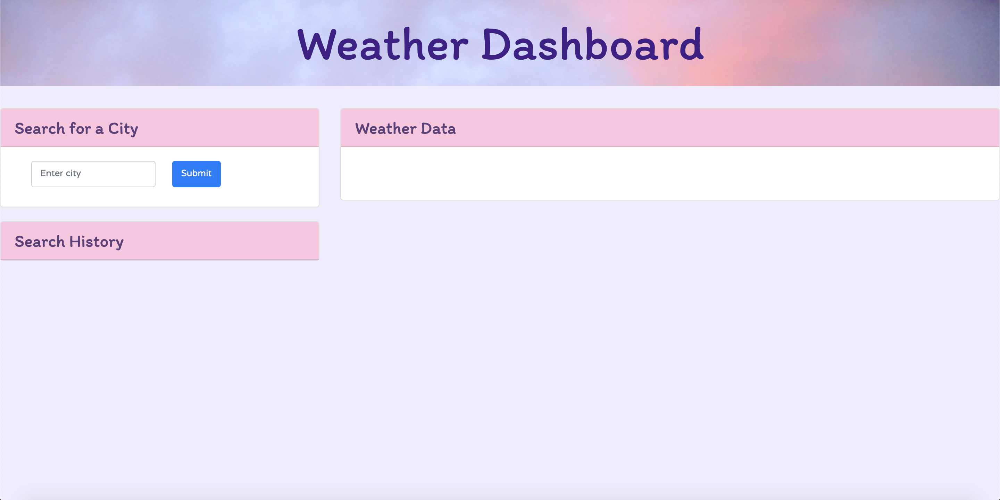
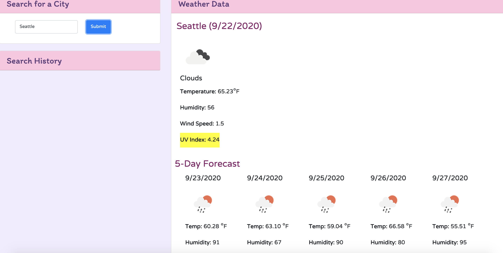
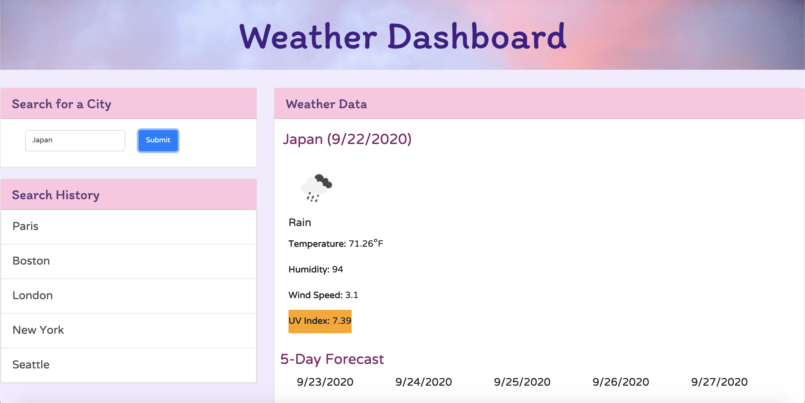

# Weather Dashboard 
> If one intends to travel to a location, it is important to check the weather in order to determine their plans and schedule. This weather dashboard application uses data from the Open Weather API to get a weather forecast for the current day in any city, as well as an overview of a 5-day forecast for the city in the future. It also stores a list of which cities were searched most recently.

## General Information

This weather dashboard includes a search function where one can type in the name of any city, located conveniently on the page's sidebar. When a city is typed in the search form and the submit button is clicked, the city's current weather data will be displayed. This data includes the current date, an icon displaying the weather, the temperature in Fahrenheit, the humidity level, the wind speed, and the UV index. The UV index will also be highlighted in a color that corresponds with its severity: it will be green for a low UV index, yellow for a moderate index, orange for a high index, red for a very high index, and pink for an extreme index.

Below the city's current weather, a 5-day weather forecast will also be displayed. This forecast will show the next five upcoming days, an icon displaying the predicted weather, and the predicted temperature and humidity for those dates. 

When a city is entered into the search bar, it will be stored in the list labeled "Search History" that is located directly under the search bar. If a user clicks on one of the items in the search history, it will reload data for that city and display it on the page. This webpage uses JavaScript, jQuery, and AJAX calls to the Open Weather API in order to get its information.

## Screenshots

The dashboard before a city is entered

The dashboard displaying weather information for a city

The search history function in use

## Acknowledgements

Special thanks to UW Coding Bootcamp for helping us with all our various API calls!